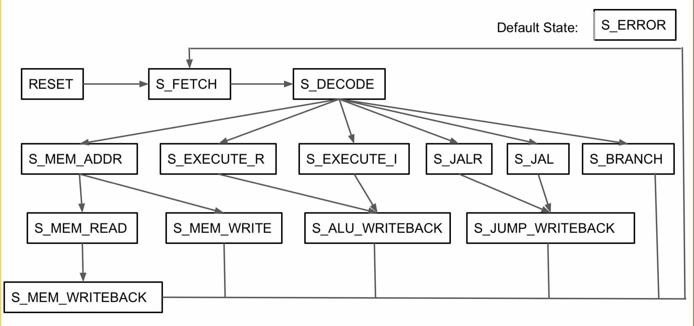
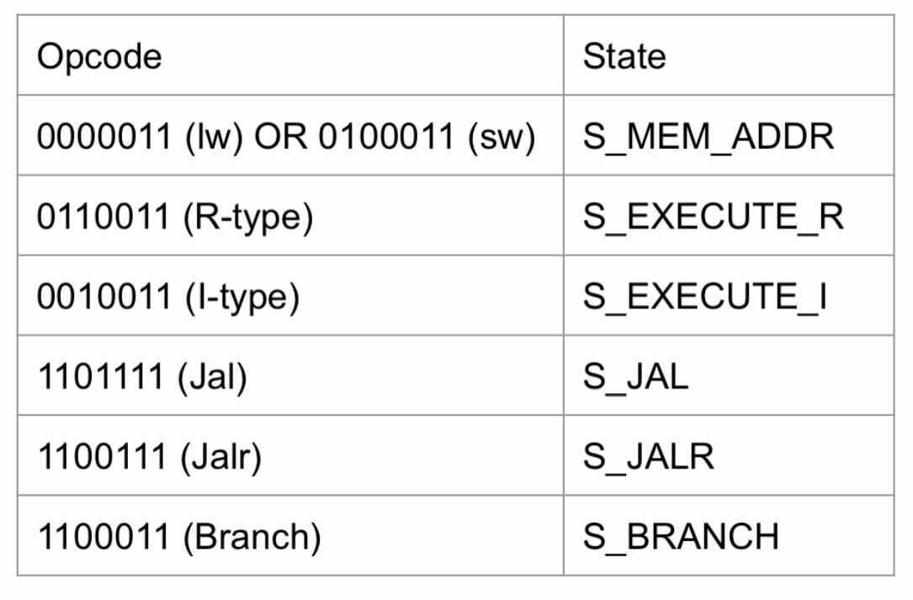
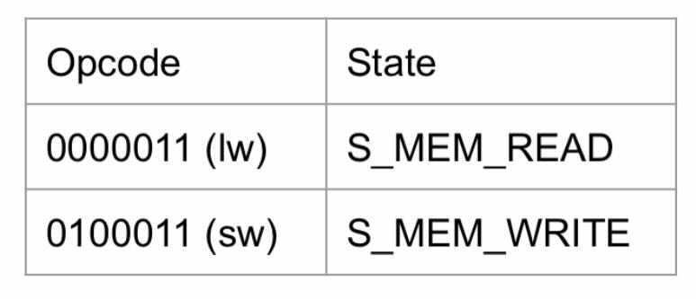
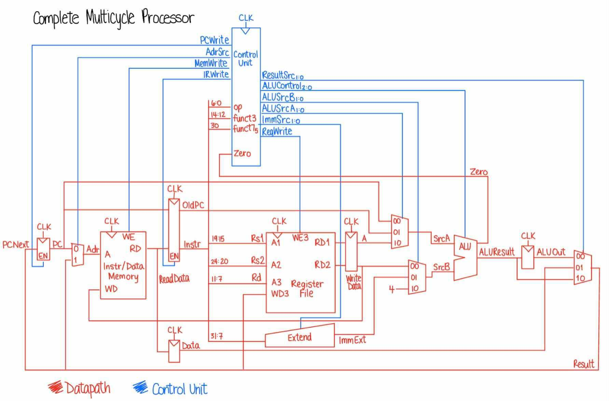

Cara Mulrooney and Dasha Chadiuk

Collaborators: Full section & CAs & Avi :)

## Instruction Checklist
Optional instructions are in italics.
### R-types
- [X] add
- [X] sub
- [X] xor
- [X] or
- [X] and
- [X] sll
- [X] srl
- [X] sra
- [X] slt
- [X] sltu
### I-types
- [X] addi
- [X] xori
- [X] ori
- [X] andi
- [X] slli
- [X] srli
- [X] srai
- [X] slti
- [X] sltiu
### Memory-Types (Loads/Stores)
- [X] lw
- [X] sw
- [ ] *lb*
- [ ] *lh*
- [ ] *lbu*
- [ ] *lhu*
- [ ] *sb*
- [ ] *sh*

### B-types (Branches)
- [X] beq
- [X] bne
- [ ] *blt*
- [ ] *bge*
- [ ] *bltu*
- [ ] *bgeu*
### J-types (Jumps)
- [X] jal
- [X] jalr (technically an i-type)
### U-types (Upper immediates)
- [ ] *lui*
- [ ] *auipc*

Note, the above list doesn't include some common psuedo-instructions like `ret` and `j` and `not` since those can be experssed in terms of what we've already listed here. See `assembler.py` for more details.

## Note from Cara and Dasha
This lab posed a great challenge, as we got caught up in a cycle of debugging for about a week and a half. In this process, we utilized our resources through reaching out to and collaborating with our peers, CAs, and Avi. After meeting with Avi and going over our code, we realized that, though our logic was sound, our implementation had several small issues blocking our progress. Over our session, we took note of several professional code practices and debugging strategies. We learned to always check that we aren’t changing the value of a variable in multiple places, always implement default states in always_comb blocks, keep variable naming conventions consistent, and group similar functional blocks together. As a group, we decided that the best, most time-efficient path forward was to use the solutions for a CPU without branches, implement branching ourselves, and finish the lab with our own custom assembly file. Although we used the CPU solution file, we still learned from the professionally-written code, as we took the time to understand the code written, run tests, and observe the gtkwave outputs. In the future, we will make sure to check that we aren't changing variable values in multiple places, keep variable naming consistent, implement default states, group similar code blocks together, and follow the datapath of each instruction in gtkwave to debug efficiently. Overall, although this lab was very challenging, we thought it was a great learning experience, as we learned to utilize our resources, communicate with others, and develop our coding practices.

## Custom Assembly File - cycle_led.s
We used bit masking to set the RGB LED colors to cycle through several options. We performed bitwise ORing in order to set a subset of of the relevant bits of the LED MMR address which let us adjust the color of the LED. We then shift the bits to set them to the right location in the address: LED 0, LED 1, red, green, or blue. 

For example: 
```Ori t0, x0, 8``` sets the first 4 bits to 1000 to turn on LED 0. We then use the ```slli``` command to shift it right by 4 (since led0 is 4 bits long). 

To set the LEDs to a specific color, we can go in order through the address and set the bits to our desired values. The order in which we have to set the bits is dictated by the order in the address. Thus, we set LED 0 first, then LED 1, then red, green, and blue. Since LED0 and LED1 are each 4 bits, we shift them by 4 bits to the left. Red, green, and blue bits of the address are each a byte long, so after setting them to our desired value, we shift them left by 8 bits. The last step is to store this information in our registers. 

Our custom assembly file includes some fun colors, such as sky blue, forest green, and coral (among others). 

## Diagrams & Schematics
### Main FSM


Note: The chosen state after S_DECODE depends on the opcode of instruction. Please reference the table below for each opcode option and its corresponding state.



Note: The chosen state after S_MEM_ADDR depends on the opcode of instruction. Please reference the table below for each opcode option and its corresponding state.


### Complete Multicycle Processor


# Multicycle RISC-V CPU
This lab is all about designing a working rv32i (integer subset of the RISC-V spec) system. The overall system (in `rv32i_system.sv`) consists of a computation core (datapath, alu, register file, etc.) and a Memory Management Unit (MMU). The MMU will be critical when we start connecting our CPU to external peripherals, but for now you can treat it as a RAM with one read/write port.

Your task is to implement `rv32i_multicycle_core.sv`. A computational core takes in our typical `clk` and `rst` signals, and can interface with memory via the `mem_addr`, `mem_wr_data`, `mem_wr_ena`, and `mem_rd_data` signals. By convention the core can only read xor write to memory in a given cycle - augmenting it to do reads and writes simultaneously is beyond the scope for this lab but could be useful for a final project around optimizing memory accesses. You should also check `rv32i_defines.sv` - it contains some useful constants from the ISA.

You are allowed to use any mix of behavioral or structural HDL for this lab, but remember that clearly drawing boundaries between your combinational logic (`always_comb`) and your registers/FSMs (`always_ff`) makes debugging much easier. 

*Warning* - the textbook's figures in Chapter 7 intentionally omit a lot of hardware (or show smaller muxes/decoders than are actually required). Use the readings as a guide, not an exact blueprint! I recommend sketching out the datapath (flow of signals between PC, the register file, the ALU, and the memory) for each type of instruction, updating it as you create more signals, muxes, decoders, etc. You may find it helpful to refer to the more detailed description of the instruction set in Chapter 6, though the reference card is included in this folder. For full detail you can refer to the [Official RISC-V Manual](https://riscv.org/wp-content/uploads/2019/12/riscv-spec-20191213.pdf)


## Assembler
To test a CPU you need a populated instruction memory. I've provided a simple python assembler (`assembler.py`), please skim the file and its usage in `Makefile` before proceeding. `assembler.py` generates `memh` files (ascii hex) that can be loaded by our simulation and synthesis tools.

There is also a `disassembler.py` file, you may find that useful for debugging but I mostly just included it for completeness (it's how I tested the assembler.)


## Running Tests
The `Makefile` uses some extra arguments and dependencies to first run the assembler to make a `memh` file, then run `iverilog` with a special flag to load the right assembly into instruction memory. The various `make test_rv32i_*` targets are a suggested flow toward implementing a complete core. After running a test you can use `make waves_rv32i_system &` to visualize the results. 

The `mmu` will also dump out the various sub-memories into `mmu_*.out` - these are optional but useful when validating your load and store instructions.


## Suggested Timeline
Designing your own CPU from scratch is both challenging and rewarding. I've provided a very minimum scaffolding here, but have *intermediate solutions available on request* (e.g. a core with r-types implemented that you can use as an example to build up to more instructions.)

- Before the break - read through the provided stub, assembler, etc.
- Monday - 11/28 - implement at least a few I and R type instructions.
- Wednesday - 11/30 - required I and R types done, start working on loads and stores.
- Monday - 12/5 - required loads and stores done, work on branches.
- Wednesday - 12/7 - get at least one branch working. 
- Monday - 12/12 - Final submission due, though ideally you've wrapped up earlier so you can focus on your final project!

## Hints and Tips
- `print` or `$display` based debugging will only help so much for this project - using `gtkwave` to visualize the results will be much more helpful. 
- The more concise the verilog, the harder it is to visualize which part of a long expression has a bug. Draw schematics, think in terms of hardware, and make sure you have a name for every meaningful bus in your design.
- A large difficulty of this lab is just tracking which instruction your core is trying to execute, as well as having human readable versions of the massive amount of bits in the waveform viewer. The following tools are aimed to help with that:
  - The custom `assembler.py` tool generates annotated `memh` files by default. If you open the corresponding `memh` file for assembly it will show you both the raw hex value and the original assembly line that it came from.
  - `gtkwave` can translate bits into words with the aid of `Translate Filter Files` and `Translate Filter Processes`.
    - `Translate Filter Files` are great for expressing `enum` types like states and mux select inputs. This [guide](http://moxielogic.org/blog/gtkwave-tip-2-translate-filter-files.html) shows how to set them up. Note that you will have to have the radix in the file match the radix in gtkwave (e.g. if you are writing unsigned decimal values in your filter file, you should right click and make sure that the representation of that signal in gtkwave is unsigned decimal as well.) 
    - `Translate Filter Processes` are similar to the filter files, but use code to represent the output instead. `gtkwave_filter.py` is an example that runs a disassembler on an instruction and represents it in human readable assembly instead. If you add this to your `IR` register in gtkwave it will make it much much much easier to see what your core is doing. To use, make sure that the IR is displayed in hexadecimal, then right click, `Data Format` -> `Translate Filter Process` -> `Enable and Select`. Then browse for `gtkwave_filter.py` and make sure it is highlighted before selectiong `OK`.

# Final Deliverable
The MVP for this project is a core that works in simulation, but I recommend pushing for a synthesizable core that can communicate with peripherals. Instructions for that part will be available after the break.

You can use `make analyze_rv32i_system` to generate a variety of reports showing timing and area results of your design - you should look through those and identify what your critical path is (and what your fastest clock speed is) as well as see what percentage of the FPGA resources you are using. 

Your submission should include any extra tests you've run, as well as sketches/block diagrams showing the main multicycle FSM as well as the datapaths for a few R, I, memory, and branch instructions. To make grading easier, mark off the instructions you have implemented on the list below before submitting.

